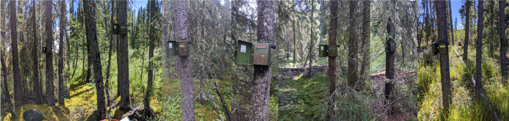

# Introduction

Recording point counts can enhance avian monitoring in Canada, providing valuable data on population trends and distribution. Integrating recording with traditional point count surveys can improve data quality and accessibility for citizen scientists, aligning metadata for accurate species detection.

The [Alberta Biodiversity Monitoring Institute](htttps://abmi.ca) and [WildTrax](https://wildtrax.ca) aim to maintain a standard infrastructure for collecting, storing and processing data from digital point counts.

## Overview and Scope

Large-scale monitoring programs are an effective way to detect changes and trends in animal populations, to foster collaborative initiatives and to improve monitoring and evaluation (Stern et al. 2005). There are several approaches that can be effective for monitoring wild birds in Canada. One approach is to conduct regular surveys of bird populations at specific locations, such as wetlands, forests, or grasslands. These surveys can be carried out by trained volunteers or professional biologists, and can involve visual observations, bird counts, and the use of recording equipment to capture bird sounds. Another approach is to use citizen science programs, where members of the public can report their observations of wild birds to a central database. This can provide valuable information on the distribution and abundance of different bird species in Canada. Additionally, conservation organizations and government agencies often have programs in place to monitor wild birds and their habitats, and can provide valuable resources for those interested in monitoring wild birds in Canada. The North American Breeding Bird Survey (BBS) is a long-term, road-based survey designed to collect quantitative data on avian population trends across the continent (Hudson et al. 2017). Provincial atlases aim to collect data from volunteers, researchers, consultants, NGOs and the provincial and federal government in partnerships to assess the current status of breeding birds and to map their distribution and relative abundance at the provincial scale (Cadman et al. 1987) and through time as atlases are repeated. Results from both of these sources drive decision-making, conservation policy and planning and provide indicators for environmental and climate change in Canada.

Augmentation of avian data collection with autonomous recording units (ARUs) along traditional survey routes has the potential to increase detection rates, reduce false positives by human observers, as well as more easily increase sampling in remote locations (Pankratz et al. 2017). Acoustic technology is becoming increasingly affordable (Shonfield et al. 2017) allowing researchers and the public to actively collect high quality acoustic information about the environment.  The differences between humans and ARUs for avian surveys is well-studied (Darras et al. 2018, Pankratz et al. 2017, Shonfield and Bayne 2017, Van Wilgenburg et al. 2017, Venier et al. 2017, Turgeon et al. 2017, Yip et al. 2019), but how to most effectively use both in a large-scale, long-term monitoring program is less understood. Establishing a standardized method to actively record the environment while simultaneously conducting point counts could significantly augment the data quality and integrity of breeding bird survey data where needed. Where possible, integrating the most accurate point count and acoustic species processing with point count survey data could synthesise an improved protocol towards avian monitoring in Canada making it more accessible to citizen scientists to collect avian data without having to be an expert. Data quality augmentation can occur by aligning metadata such as location accuracy, anthropogenic and geophonic events with observed species detections from point counts.

## CanAvian

Our mission is to improve accessibility and increase use of avian data and information in Canada by enhancing data sharing, networking, and collaboration. Our vision to provide reliable and comprehensive avian data and information are openly available to support biodiversity conservation and decision-making in Canada.

