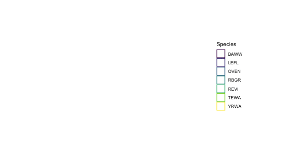
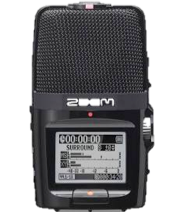
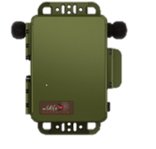
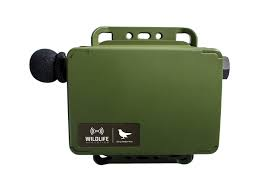
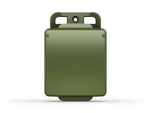
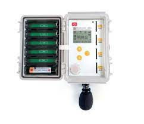
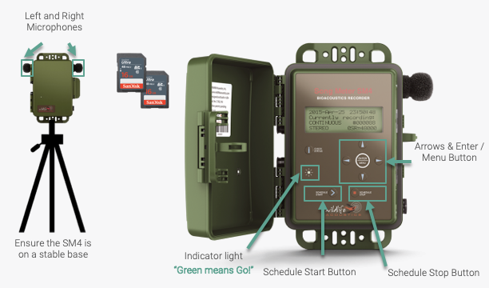
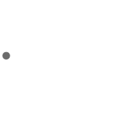
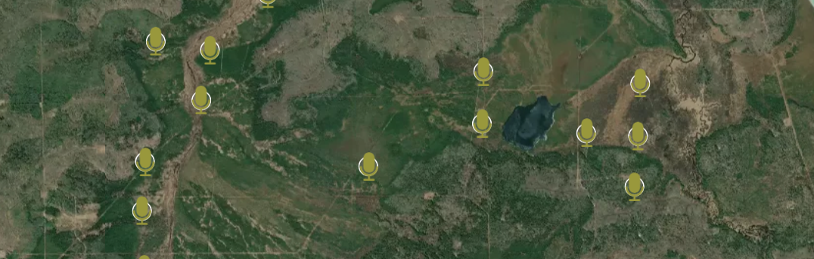
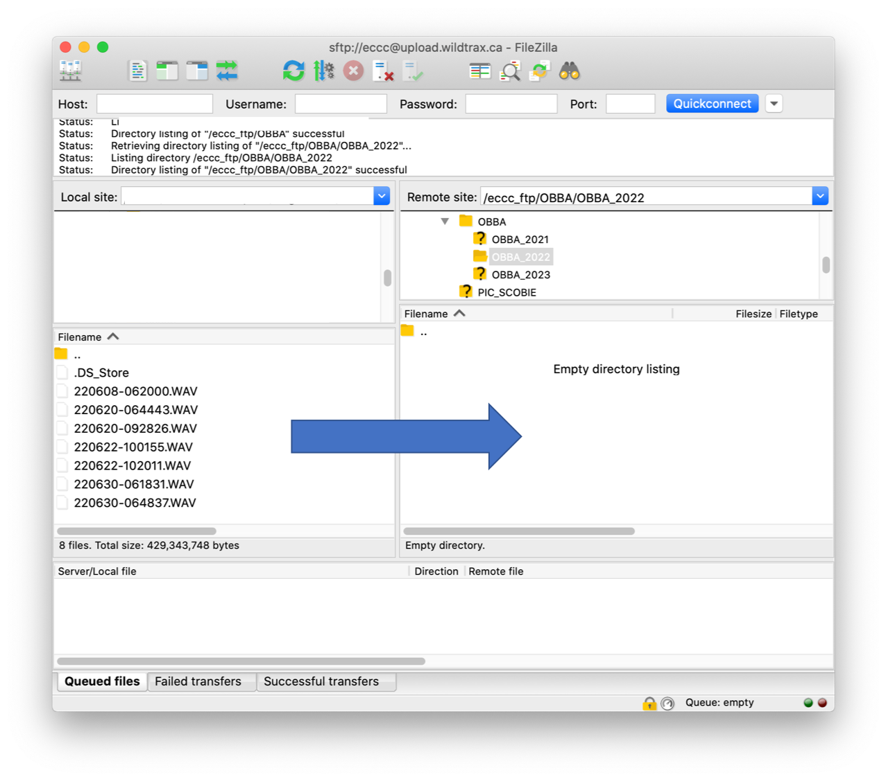

# Methods

In order to *digitize* a point count, it must be recorded. This involves selecting an appropriate autonomous recording unit (**ARU**) or hand-held recording device that will suit your monitoring program's needs and [budget](#selecting-a-recorder). **Autonomous** refers to the ability for the recorder to turn on and off without human intervention for set periods until the SD cards fill up, or the batteries run out.

When recording the soundscape during a point count, it is important to consider both the animals that produce sounds and the recorders themselves, which have an **effective detection radius**. The effective detection radius refers to the distance from the recorder within which the loudest sounds will be captured. As sounds become fainter with distance, the ability of an observer (or in this case, recorder) to detect them drops, which is referred to as **perceptibility**.

```{r, eval=F, include=F}

circles <- data.frame(
  x0 = c(0,0,0),
  y0 = c(0,0,0),
  r = c(50, 100, 150),
  timing_order = c(1,2,3)) %>%
  as_tibble()

birds <- data.frame(
  x0 = c(-40, 10, 16, 11, -50, 70, 0, -60, 30, -20),
  y0 = c(40, -25, -22, -72, 30, -60, 50, -10, -40, 15),
  r = c(5, 10, 15, 20, 8, 12, 6, 18, 10, 7),
  Species = c("OVEN", "TEWA", "TEWA", "LEFL", "LEFL", "YRWA", "REVI", "REVI", "RBGR", "BAWW"),
  timing_order = sample(1:10, 10, replace = FALSE)) %>%
  as_tibble()

zoom <- image_read('./images/littlezoom.png')

mycircles <- ggplot() +
  annotation_custom(rasterGrob(zoom, width = 0.1)) +
  geom_circle(aes(x0 = x0, y0 = y0, r = r), data = circles) +
  geom_circle(aes(x0 = x0, y0 = y0, r = r, colour = Species), data = birds) +
  scale_colour_viridis_d() + 
  coord_fixed() +
  transition_layers(layer_length = 1, transition_length = 2) +
  enter_grow() +
  enter_fade() +
  theme_void()

anim_save("./images/circles.gif", mycircles, width=600, height=300, duration=5)

```


<br>



To accurately capture the soundscape, it is important to place the recording device in a location that maximizes the perceptibility of the observer while minimizing interference from external sources. Additionally, it is important to ensure that the recording device is calibrated and set to appropriate recording settings to capture sounds effectively. This next section will help you through these steps.

---

## Selecting a recorder


<hr style="height:2px; visibility:hidden;" />

The [**Zoom**](https://zoomcorp.com/en/ca/handheld-recorders/handheld-recorders/h2n-handy-recorder/) H2N, is a hand-held portable recorder with multiple built-in microphones. It is affordable, lightweight, and easy-to-use for an introductory user. 

- [H2N equipment setup](#h2n-equipment-setup) and [H2N survey deployment](#h2n-segmented-survey-deployment)

<hr style="height:2px; visibility:hidden;" />

[**Wildlife Acoustics**](https://www.wildlifeacoustics.com/products/song-meter-sm4) sell weatherproof, durable, autonomous recorders with external microphones and advanced recording features.

<hr style="height:2px; visibility:hidden;" />




- [SM4 equipment setup](#sm4-equipment-setup) and SM4 survey deployment for [segmented](#sm4-segmented-survey-deployment) and [continuous](#sm4-continuous-survey-deployment) recording methods
- [SM Mini equipment setup](#sm-mini-equipment-setup) and [SM Mini survey deployment](#sm-mini-segmented-survey-deployment)
- [SM Micro equipment setup](#sm-micro-equipment-setup) and [SM Micro survey deployment](#sm-micro-segmented-survey-deployment)


<hr style="height:2px; visibility:hidden;" />

[**Frontier Labs**](https://www.frontierlabs.com.au/product-page/bar-lt) sell the BAR-LT which is a durable acoustic recorder, including advanced features such as rechargeable batteries and an internal GPS.

- [BAR-LT equipment setup](#bar-lt-equipment-setup) and BAR-LT survey deployment for [segmented](#bar-lt-segmented-survey-deployment) and [continuous](#bar-lt-continuous-survey-deployment) recording methods.

<br>

```{r, eval=T, include=T, warning=F, message=F, echo=F}
library(kableExtra)

df <- data.frame(
  H2N = c("No", "Yes", "$200", "230 g", "Few", "No"),
  SM4 = c("Yes", "Yes", "$1000", "5400 g", "Many", "Yes - with accessories"),
  Mini = c("Yes", "No", "$600", "290 g", "Many", "Yes - with accessories"),
  Micro = c("Yes", "No", "$300", "195 g", "Many", "Yes - with accessories"),
  BAR_LT = c("Yes", "Yes", "$1000", "900 g", "Many", "Yes"),
  row.names = c("Autonomous", "Display Screen", "Price", "Weight with batteries", "Advanced features", "GPS tracking")
)

# Create kable table
kable(df, booktabs = T, caption = "Equipment comparison", format = "html", align = "c", row.names = TRUE) %>%
  kable_styling(bootstrap_options = "striped", full_width = FALSE) %>%
  column_spec(1, bold = TRUE)

```

### General equipment care

Always handle any equipment with care. Recorders contain sensitive electronic components that will not withstand crushing or heavy impacts. Do not use excess force to manipulate components and conduct all operations gently. See more on handling equipment in [wet weather](#wet-weather).

---
    
## Equipment and settings preparation

:::{.rmdnote}
Calibration and testing of equipment is a critical step in any acoustic survey. Ensuring the functionality of the recorder and its components are checked, helps to identify any issues that could affect the quality of the data, such as faulty wiring or damaged components. Testing should be done prior to every use of the equipment, and any problems that are identified should be addressed before data collection begins.

Contact **support@wildtrax.ca** for more information on acoustic recorder equipment care and maintenance.
:::

By calibrating and testing equipment before conducting an acoustic survey, researchers can ensure that the data collected is accurate and reliable. This is essential for making accurate measurements of sound levels and other acoustic parameters.

### H2N equipment setup

The following equipment is required in order to conduct the survey protocol using an H2N

- 1 SD card; a 32 GB card will allow you to collect ~1,000 3-minute audio recordings. See [Data accumulation](#data-accumulation).
- 2x AA batteries (pack at least 2 spare AA batteries; re-chargeable batteries are recommended
- Windsock
- Tripod

Ensure the H2N's firmware is also the most recent version.

```{r, include = T, eval = T, echo=F}
library(downloadthis)

download_file(path = "./data/H2n_v3.00E.zip", button_label = "Download Zoom H2N Firmware", has_icon=T, icon = "fa fa-save", self_contained=F)
```

#### H2N Settings

The following settings will allow you to easily record and integrate data with other Zoom recordings:

##### Setting the date and time {.unnumbered}

- Turn on the device using the <span style="font-variant:small-caps;">Power</span> switch.
- Press the <span style="font-variant:small-caps;">Menu</span> button, toggle the <span style="font-variant:small-caps;">Play</span> button up/down and then press down to select <span style="font-variant:small-caps;">System</span>. 
- Select <span style="font-variant:small-caps;">Date/Time</span>
- Use the <span style="font-variant:small-caps;">Play</span> button to select and modify the year, day, month, and time settings as needed. 
- When all settings are correct, select <span style="font-variant:small-caps;">OK</span> and press the <span style="font-variant:small-caps;">Play</span> button to exit. 


<hr style="height:2px; visibility:hidden;" />

##### Defaulting to date and time file names {.unnumbered}

Ensure that <span style="font-variant:small-caps;">Filename</span> (under <span style="font-variant:small-caps;">Rec</span> settings) is set to <span style="font-variant:small-caps;">Date</span> so that individual files will be named by the date/time of the start of recording, e.g. `230604-053010` which corresponds to the year, month day, hour, minute and second the recording started. Do not use <span style="font-variant:small-caps;">Default</span>.

##### Audio settings {.unnumbered}

Ensure the recorder uses the following settings:

- <span style="font-variant:small-caps;">2CH</span> selected on channel selector dial
- <span style="font-variant:small-caps;">Mic Gain</span> set to `10` (maximum)
- <span style="font-variant:small-caps;">Surround</span> is set to `S±0`. This is *really easy to change by accident*, because it is changed by moving the <span style="font-variant:small-caps;">Play</span> lever while in <span style="font-variant:small-caps;">Record</span> mode)
- <span style="font-variant:small-caps;">Rec Format</span> is set at <span style="font-variant:small-caps;">Wav</span> (when you turn on the recorder, the <span style="font-variant:small-caps;">Rec</span> format is displayed on the lower left [e.g., 44.1/16]. If it doesn’t match, go to <span style="font-variant:small-caps;">Menu</span> to change it under <span style="font-variant:small-caps;">Rec</span> settings)
- Use `44.1kHz/16 bit` (there are other wav settings that would also work but use a little or a lot more memory). Do not use MP3. 


<hr style="height:2px; visibility:hidden;" />

Other audio settings include:

- <span style="font-variant:small-caps;">Auto Rec</span> is <span style="font-variant:small-caps;">Off</span>
- <span style="font-variant:small-caps;">Lo Cut</span> is <span style="font-variant:small-caps;">On</span> (useful to reduce impacts of wind or traffic noise)
- <span style="font-variant:small-caps;">Comp Limiter</span> is <span style="font-variant:small-caps;">Off</span>
- <span style="font-variant:small-caps;">Auto Gain</span> is <span style="font-variant:small-caps;">Off</span>

Ensure the side bar also has these settings:

- <span style="font-variant:small-caps;">MS Side Level</span>: `0 (120 degrees)`
- <span style="font-variant:small-caps;">Input Setting</span>: Plug-in Power

### SM4 equipment setup


<hr style="height:1px; visibility:hidden;" />

The following additional equipment is required in order to conduct the survey protocol:

- 1 SD card; a 32 GB card will allow you to collect ~1,000 3-minute audio recordings. See [Data accumulation](#data-accumulation).
- 4x D batteries (pack at least 4 spare D batteries)
- Tripod

Ensure [firmware](https://www.wildlifeacoustics.com/release-notes/song-meter-sm4) is the most recent version.

#### SM4 Settings

- Open the front cover of the unit
- Turn on the <span style="font-variant:small-caps;">Power</span> switch on the side of the unit
- Wait for the unit to initialize. SM4 units will automatically go to the <span style="font-variant:small-caps;">Main Menu</span> screen displaying the date, time, firmware and number of SD cards loaded. Make sure that the card slot does not show a row of question marks `??????` or say <span style="font-variant:small-caps;">Error</span>. This indicates that the card is not recognized
- Check the date and time are correct
- Use the arrows to navigate back to the <span style="font-variant:small-caps;">Main Menu</span>
- Select the <span style="font-variant:small-caps;">Settings</span> section.
- Scroll down to <span style="font-variant:small-caps;">Location</span> and select <span style="font-variant:small-caps;">File Prefix</span>. Change the file prefix to **your initials**

:::{.rmdnote}
Using simply your initials, recordings will be unique using the recording date and time:

| AGM_**20230605_053000**.wav
| AGM_**20230605_063000**.wav
| AGM_**20230607_0645000**.wav
| AGM_**20230607_073000**.wav

<br>

Alternatively, you can change the prefix to match the survey route or group where the data is being collected:

| *17TPM25*_**20230605_053000**.wav
| *17TPM25*_**20230605_063000**.wav
| *17TPM26*_**20230607_0645000**.wav
| *17TPM26*_**20230607_073000**.wav

<br>

Ultimately the goal is to *reduce the amount of times* you need to re-program the equipment throughout a morning, or the survey season.
:::

Other settings include:

- Timezone: For example, UTC -06 for Alberta between March and November (this is -6 from Prime Meridian =
Mountain Standard Daylight Savings Time)
- Batteries: 4 D-Cell batteries (Internal, Alkaline)
- Channel: Stereo
- Gain: Left and right at 12.5 dB (BU specific settings file)
- High-pass filter: Left and right Off
- Sample Rate: 44100 kHz

##### Activating the SM4 {.unnumbered}

In order to start a recording, press the <span style="font-variant:small-caps;">Up and Down Arrows</span> simultaneously. To stop the recording hit the <span style="font-variant:small-caps;">Schedule Stop</span> button.

:::{.rmdwarning}
Turning the recorder off with the power switch during a recording may not save the recording. Always use Schedule Stop.
:::

#### Troubleshooting the SM4 {.unnumbered}

- If the SM4 will not start after the power is switched on, press the <span style="font-variant:small-caps;">Check Status</span> button. If the unit still won't turn on, switch off the <span style="font-variant:small-caps;">Power</span> and take out the batteries and put them back in.

Please also refer to a detailed manual of the SM4's operations by visiting [Wildlife Acoustics](https://www.wildlifeacoustics.com/uploads/user-guides/SM4-USER-GUIDE-20201022.pdf) User Guide and the [Bioacoustic Unit's Deployment Protocol](http://bioacoustic.abmi.ca/wp-content/uploads/2018/01/DeploymentProtocol_e.pdf).

### SM Mini equipment setup

<span style="color:grey;font-style:italic">Coming soon!</span>

<hr style="height:1px; visibility:hidden;" />

#### Required equipment

#### Settings

### SM Micro equipment setup

<span style="color:grey;font-style:italic">Coming soon!</span>

<hr style="height:1px; visibility:hidden;" />

#### Required equipment

#### Settings

### BAR-LT equipment setup

<span style="color:grey;font-style:italic">Coming soon!</span>

<hr style="height:1px; visibility:hidden;" />

#### Required equipment

#### Settings

---

## Conducting the survey

Conducting the survey is the core piece of work that you'll be doing. This is when you will be placing the recorder at a designated [location](#locations) on the landscape in order to capture the soundscape for a given duration. 

There are two different types of recording methods that can be used throughout a survey route: [**segmented**](#segmented-recording) and [**continuous**](#continuous-recording).

### Segmented recording

The **segmented** recording method means you will be turning the recorder on and off at each location along a survey route. Segmented recording is the most popular method for on and off-road deployments. The advantage is that you will only [accumulate data](#data-accumulation) and recordings for the intended period matching the point count. The disadvantage is that you need to be mindful and carefully follow the steps in order to collect this data properly - manipulating the recorder again and again can introduce error. 

<br>


```{r, echo=F,warning=F,message=F,include=F,eval=F}
# library(ggplot2)
# library(gganimate)
# library(tidyverse)
# 
# # Create data frame
# df <- tibble(x = seq(-10, 10, by = 0.25),
#              y = (sin(x) * (x^2 + 2*x) / (x^2 + 1)),
#              stop_time = case_when(x %in% c(-7,-5,-3,-2,0,1,4,6,8) ~ TRUE))
# 
# # Create ggplot object
# segmented_gif <- ggplot(df, aes(x = x, y = y, colour=stop_time)) +
#   geom_point(aes(size=4)) +
#   transition_states(x, transition_length=2, state_length=1) +
#   enter_fade() +
#   exit_fade() +
#   theme_void() +
#   theme(legend.position = "none",
#            axis.text.x = element_blank(),
#            axis.text.y = element_blank(),
#            panel.grid.major = element_blank(),
#            panel.grid.minor = element_blank())
# 
# anim_save("./images/segmented.gif", segmented_gif, width=200, height=200, duration=10)

```

In general, a segmented recording method will involve the following steps, but refer to each subsection specific to a recorder make and model.

- Arrive at a survey location and follow safety instructions outlined by the designated point count protocol.
- Set up the recorder at a fixed location, keeping it at a minimum distance of 5 meters away but no more than 20 meters away if you're simulatenously conducting a point count in order to minimize error (*if you're not conducting a point count, stand a minimum of 5 meters away*). 
- A tripod or stable surface is recommended to support the ARU. Do not place the recorder on or near a vehicle as it will pick up vibrations that could mask species detections. Placing the recorder to the rear of the vehicle can also minimize the sounds made from a vehicle engine (e.g. car, truck, quad, etc.) after it is shut off.
- Turn on the unit and speak the designated [voice note](#voice-notes). Move away from the recorder to begin the count and say <span style="font-variant:small-caps; color:#003e3f">Start</span>
- At the end of the count, say <span style="font-variant:small-caps; color:#003e3f">Stop</span>.
- Turn off the recorder and move to the next location. Repeat steps as necessary to conduct more surveys along a route.

:::{.rmdwarning}
Do not to speak during the point count survey itself to limit erroneous speech errors picked up by the speech-to-text recognizer
:::


#### H2N segmented survey deployment 


<hr style="height:1px; visibility:hidden;" />

- Arrive at a survey location and follow safety instructions outlined by the designated point count protocol.
- Set up the recorder at a fixed location
- Turn on the device using the <span style="font-variant:small-caps;">Power</span> switch.
- Initiate the survey by pressing the <span style="font-variant:small-caps;">Record</span> button
- Speak a clear [voice note](#voice-notes). Include your name, location (spatial coordinates or identifier) and the date.
- Move 5-20 meters away from the recorder to reduce observer noise.
- Say <span style="font-variant:small-caps; color:#003e3f">Start</span> and begin the count
- Extend the survey as needed
- At the end of the count, say <span style="font-variant:small-caps; color:#003e3f">Stop</span>.
- Turn off the recorder and move to the next location. Repeat steps as necessary to conduct more surveys along a route.


#### SM4 segmented survey deployment


<hr style="height:1px; visibility:hidden;" />

- Arrive at a survey location and follow safety instructions outlined by the designated point count protocol.
- Set up the recorder at a fixed location
- Turn on the device with the <span style="font-variant:small-caps;">Power</span> switch and check the unit is activated.
- Initiate the survey by pressing the <span style="font-variant:small-caps;">Schedule Start</span> button
- Once the <span style="font-variant:small-caps; color:green">Green Light</span> is flashing, speak a clear [voice note](#voice-notes). Include your name, location (spatial coordinates or identifier) and the date.
- Move 5-20 meters away from the recorder to reduce observer noise.
- Say <span style="font-variant:small-caps; color:#003e3f">Start</span> and begin the count
- Extend the survey as needed
- At the end of the count, speak <span style="font-variant:small-caps; color:#003e3f">Stop</span>.
- Turn off the recorder by pressing the <span style="font-variant:small-caps;">Schedule Stop</span> button and move to the next location. Repeat steps as necessary to conduct more surveys along a route.
- At the end of a survey route, turn off the recorder with the <span style="font-variant:small-caps;">Power</span> switch

#### SM Mini segmented survey deployment

<span style="color:grey;font-style:italic">Coming soon!</span>

<hr style="height:1px; visibility:hidden;" />

#### SM Micro segmented survey deployment

<span style="color:grey;font-style:italic">Coming soon!</span>

<hr style="height:1px; visibility:hidden;" />

#### BAR-LT segmented survey deployment

<span style="color:grey;font-style:italic">Coming soon!</span>

<hr style="height:1px; visibility:hidden;" />


### Continuous recording

In the **continuous** recording method, you will be turning the recorder on at the beginning of a survey route, and turning it off at the end of a survey route. A survey route can include many [locations](#locations). For example, a Breeding Bird Survey route may be conducting using a continuous recording method, allowing you to focus time on conducting point counts.

<br>


```{r, echo=F,warning=F,message=F,include=F,eval=F}
# library(ggplot2)
# library(gganimate)
# library(tidyverse)
# 
# # Create data frame
# df_c <- tibble(x = seq(-10, 10, by = 0.25),
#              y = (sin(x) * (x^2 + 2*x) / (x^2 + 1)))
# 
# # Create ggplot object
# continuous_gif <- ggplot(df_c, aes(x = x, y = y)) +
#   geom_point(aes(size=4)) +
#   geom_path() +
#   transition_reveal(along = x) +
#   enter_fade() +
#   exit_fade() +
#   theme_void() +
#   theme(legend.position = "none",
#            axis.text.x = element_blank(),
#            axis.text.y = element_blank(),
#            panel.grid.major = element_blank(),
#            panel.grid.minor = element_blank())
# 
# anim_save("./images/continuous.gif", continuous_gif, width=200, height=200, duration=10)

```

- Arrive at the beginning of the survey route and follow safety instructions outlined by the designated point count protocol.
- Turn on the recorder and speak the designated voice note. Move away from the recorder to begin the count and say <span style="font-variant:small-caps;">Start</span>
- At the end of the count, speak <span style="font-variant:small-caps;">Stop</span>.
- Move to the next location along the survey route. Repeat steps as necessary. Verify at *each location* the recorder is still active.
- At the end of the survey location, turn off the recorder.

:::{.rmdwarning}
Only SM4 and BAR-LT are currently supported for the continuous recording method.

**Please note that this unit will continuously and indiscriminately record and capture all sounds. We kindly request that you use discretion and be mindful of what is being recorded out of respect for your own privacy and the privacy of others.**
:::

#### SM4 continuous survey deployment

<span style="color:grey;font-style:italic">Coming soon!</span>

<hr style="height:1px; visibility:hidden;" />

#### BAR-LT continuous survey deployment

<span style="color:grey;font-style:italic">Coming soon!</span>

<hr style="height:1px; visibility:hidden;" />


### Survey length adjustment

Surveys are supposed to be a certain length. Surveys may occur along roadsides, near areas of loud anthropogenic noise, or interrupted by intermittent or inclement weather. In order to optimize species detections, survey time can be extended by 1 minute per event up to maximum survey length time of 10 minutes (or in the case of Marshbird Monitoring Protocol, 15-minutes). 

It’s recommended to keep a stopwatch or phone timer set to the length of the survey interval, and the maximum survey interval so you don’t have to keep track of the events specifically but rather the time you can survey for. 


<hr style="height:2px; visibility:hidden;" />

For example, if a vehicle is passing, extend the survey for up to one minute.

Geophonic events are similar; if it becomes too windy or rainy to continue the survey, i.e. if geophonic events last for >10 minutes during the survey, the media will be considered [*Bad Weather*](https://www.wildtrax.ca/home/resources/guide/acoustic-data/acoustic-tagging-page.html). Surveys can be extended for 1 minute at a time for intermittent periods of rain or wind.

:::{.rmdnote}
It's possible the survey is taking place in an environment when anthropogenic noise can't be avoid. In this case, survey for the standard amount of time dictated by your protocol.
:::

### Wet weather

Extra care is required to handle ARUs in wet weather. When units such as Song Meters are closed, they are water tight and can withstand most weather conditions in the field. However, do not get water inside on the electronic components or into the external microphone sockets. Water will short out the electrical circuits and may cause permanent damage to the units.

Take extra care on activation and deactivation on rainy days. Having wet hands, gloves and clothing will make it difficult to keep the inside of the equipment dry. Try to minimize the amount of time an ARU is exposed should you encounter inclement weather.

:::{.rmdwarning}
Do not record any point when the wind is greater than Beaufort 3
:::

---

## Metadata

### Locations


<br>

In the context of this protocol, a **location** is a single physical, geographic place at which a digital point count is collected and/or biological data was collected on the landscape. They are one of the most important components as media and metadata are linked by the location.

### Voice notes

Voice notes serve as an effective tool for capturing spatial and temporal information in each recording. The purpose is to verbally state a predetermined set of metadata at the beginning of a digital point count, allowing programs to standardize the recording by incorporating both spatial and temporal components. This eliminates the need to manually modify the file prefix or reprogram the unit during the survey. A [speech-to-text](#speech-to-text) recognizer converts the spoken words into usable text, which can then be utilized to assign a standardized name to the recording file.

While there is no specific speaking order required, a voice note must include the following minimum information:

- [Location](#locations) name
- Date and time
- Observer's name

<br>

Here is an example of a voice note for a named location:

```{r setup, include = FALSE, echo=F}
html_tag_audio <- function(file, type = c("wav")) {
  type <- match.arg(type)
  htmltools::tags$audio(
    controls = "",
    htmltools::tags$source(
      src = file,
      type = glue::glue("audio/{type}", type = type)
    )
  )
}
```

```{r, echo=F}
html_tag_audio("./assets/named_location.wav", type = "wav")
```

<br>

If the location is new, it is also necessary to provide latitude and longitude coordinates. Here is an example of an off-road or new location voice note:

```{r, echo=F}
html_tag_audio("./assets/new_location.wav", type = "wav")
```

<br>

:::{.rmdwarning}
If you're in the field, and the location doesn't have a name, don't panic! As long as the latitude and longitude are provided, a name can be given to the location afterwards.
:::

Creating a standard file name format after processing the voice note is then completed. For example, the format for [Zoom](#h2n-equipment-setup) recordings should be in `YYMMDD` (year, month, day), and the time should be in `HHMMSS` (hour, minute, second) format. The resulting file name format after the processing will be in the following format: `LOCATION_YYYYMMDD_HHMMSS.wav`.

#### Speech-to-text

:::{.rmdnote}
*This is A B M I dash Five Six Five dash S W. The date is February 23rd 2022 and the time is 11:06 AM Mountain standard time. Observers are John Doe and Jane Doe*

| **File name**: ABMI-565-SW_20220223_110600
| **Observers**: John Doe, Jane Doe

<br>

*Pat Patterson May 30 2022 17 tm n-65 station for 47.4 4736 to -81.4 to 3727 start time 10:05*

| **File name**: 17TMN65-4_20220530_100500
| **Spatial coordinates**: 47.447362, -81.423727
| **Observer**: Pat Patterson
:::

A speech-to-text recognizer is used to transcribe the voice note into text information in order to extract the location name, spatial coordinates or confirm the temporal stamp of the ARU, all for quality control purposes. The [Google Cloud Speech-to-Text](https://cloud.google.com/speech-to-text) recognizer is an advanced deep learning neural network using algorithms for automatic speech recognition. The recognizer can also use one of several machine learning models to transcribe the audio files, support for French and other language variants, and alternatives based on likelihood values. Google has trained these speech recognition models for specific audio types and sources. 

For example, time stamps derived from the observer speech-to-text array as well as the recording time stamp from the audio would be joined into to create a unique location and recording date with the file prefix from the ARU.

### Data accumulation

This app should help to determine how much data you will collect depending on sample size and survey duration.

```{r, echo=F}
knitr::include_app("https://agmacpha.shinyapps.io/volume_calc/",
  height = "400px")

```

---

## Data submission

After recordings are collected, they can be uploaded to a centralized server in Edmonton, Alberta called **Cirrus**. Cirrus is administered by the [University of Alberta SRIT](https://spaces.facsci.ualberta.ca/cirrus/about-us/). The Bioacoustic Unit and its collaborators use Cirrus to house and standardize acoustic data for redundancy and permanent storage on a cost-recovery basis. Cirrus contains a variety of different types of data but a large majority of the volume is currently being occupied with environmental sensor data i.e. acoustic recordings and remote camera images.

Raw recordings are uploaded to Cirrus via an FTP or *file transfer protocol* in order to standardize them before they are processed in WildTrax. You can download an FTP client like [Filezilla](https://filezilla-project.org/). Once you have installed the FTP client, enter the following credentials:

:::{.rmdnote}
- **Host**: upload.wildtrax.ca or sftp://upload.wildtrax.ca
- **User**: eccc
- **Password**: w0rdb1rd
- **Port**: 22
:::

Once you've logged in, create or go to the [organization](https://www.wildtrax.ca/home/resources/guide/organizations/organization-management.html) that corresponds with your data. If you're unsure which organization you belong to, contact **support@wildtrax.ca**. Organization your recordings with the following folder structure:

```{r}
# OBBA <- The organization
    # OBBA_2023 <- The project
        # Jane_Doe <- The observer

```


You can also place the recordings in a folder under the following hierarchy:

Organization > Sensor > Project > Year > Visit > *Group* > Location

```{r}
# BU <- The organization
    # ARU <- The sensor 
        # BUM  <- The field project, e.g. BUM = Bioacoustic Mobile
            # 2022 <- The year of the study
                # V1 <- The visit
                    # BUM-401 <- The location
                    # Below this level will be all the files for that location

```

Where *group* is a set of locations on the landscape. For example a [Breeding Bird Survey route](), e.g. `BBS-4239` would be a group and `BBS-4239-1` would be a location.

Once your files are organized, drag and drop them into the folder on the FTP. A queue in the bottom will let you know if files transferred successfully. 



### Metadata confirmation


<hr style="height:2px; visibility:hidden;" />

- Ensure the file name convention of the recordings follows either `YYMMDD-HHMMSS` or `LOCATION_YYYYMMDD_HHMMSS` format
- Ensure the folder structure follows the [standard hierarchy](#data-submission)
- If there are zero-length files or files smaller than the intended length of the count, **do not upload these files**

:::{.rmdwarning}
You can technically upload all recordings directly to a project on WildTrax provided you are given the correct privileges. If the FTP is not functioning, this is an alternative option.

Contact **support@wildtrax.ca** for more information.
:::

## Data processing in WildTrax

Once the recordings are trimmed to the correct length of time, ABMI staff will upload them to appropriate projects in WildTrax. Go to My Data -> My Projects and search for the appropriate project for your data.


<br>

---

## Data publication

Once the project is completed, the status can be switched to one of the *published* statuses, allowing the public and other WildTrax users, as well as NatureCounts to receive data.

