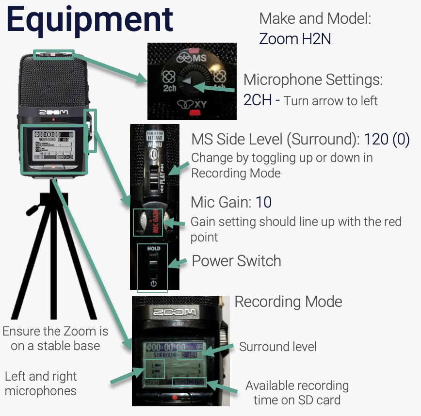
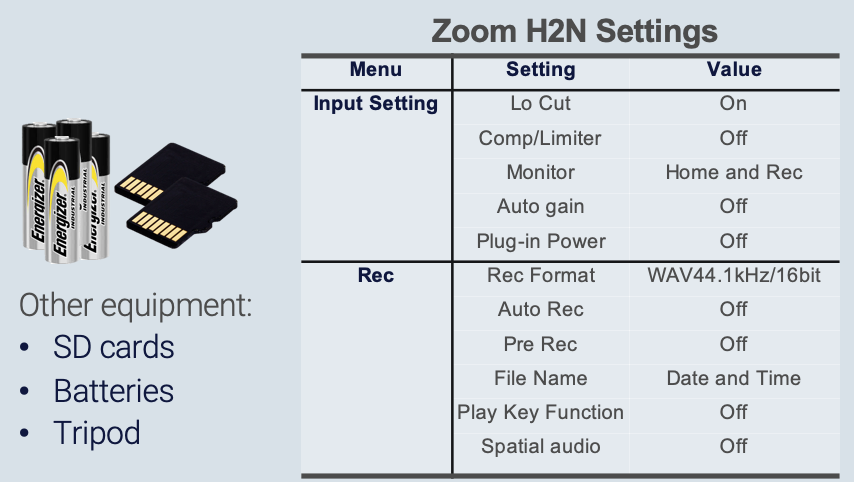
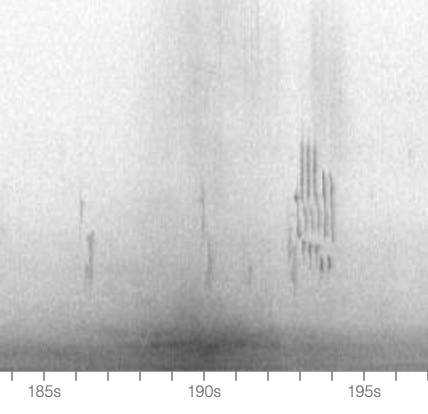
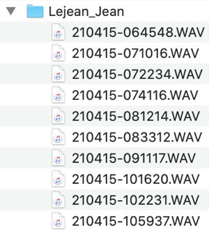
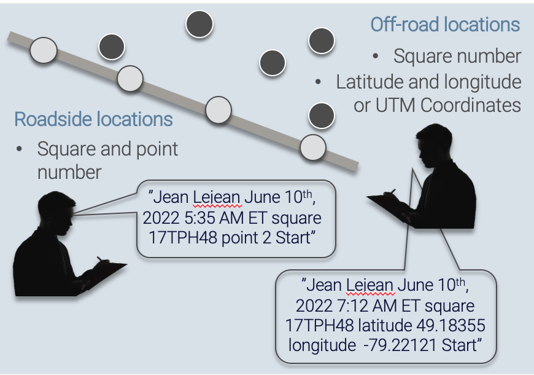
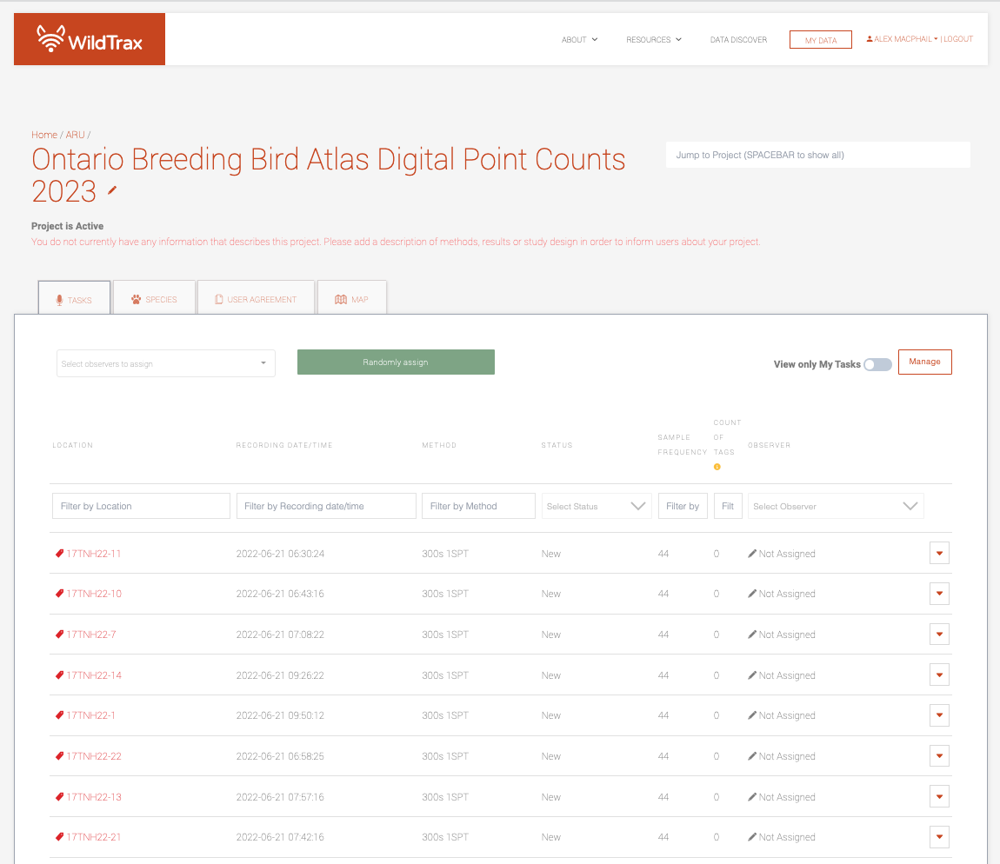

# Methods

## Selecting a recorder

Consider selecting an affordable, readily available, and user-friendly autonomous recording unit (ARU) or handheld recording device. Here are some recommended options:

- [Zoom H2N](https://zoomcorp.com/en/ca/handheld-recorders/handheld-recorders/h2n-handy-recorder/) are a handheld portable recorder with multiple built-in microphones. It is affordable, lightweight, and easy to use for an introductory user.
  + [H2N Equipment Setup](#h2n-equipment-setup)
  + [H2N Survey Deployment](#h2n-survey-deployment)
- [Wildlife Acoustics](https://www.wildlifeacoustics.com/products/song-meter-sm4) sell weatherproof, mountable autonomous recorders that requires external microphones but offer advanced recording features and durability but comes at a higher price.
  + [SM4 Equipment Setup](#sm4-equipment-setup)
  + [SM4 Survey Deployment]()
  + [SM Mini Equipment Setup]()
  + [SM Mini Survey Deployment]()
  + [SM Micro Equipment Setup]()
  + [SM Micro Survey Deployment]()
- [Frontier BAR-LT]()
  + [BAR-LT Equipment Setup]()
  + [BAR-LT Survey Deployment]()
    
## Equipment and Settings Preparation

Calibration and testing of equipment prior to conducting a survey is essential for collecting high-quality acoustic data.

### H2N Equipment Setup

- Ensure firmware is the most recent version.

```{r, include = T, eval = T}
library(downloadthis)

download_file(path = "./data/H2n_v3.00E.zip", button_label = "Download Zoom H2N Firmware", has_icon=T, icon = "fa fa-save", self_contained=F)
```

#### Required equipment

The following additional equipment is required in order to conduct the survey protocol:

- 1 SD card; a 32 GB card will allow you to collect ~1,000 3-minute audio recordings
- 2x AA batteries (pack at least 2 spare AA batteries)
- Windsock
- Tripod

#### Settings

The following settings will allow you to easily record and integrate data with other Zoom recordings:

##### Setting the date and time {.unnumbered}

- Turn on the device using the <span style="font-variant:small-caps;">Power</span> switch.
- Press the <span style="font-variant:small-caps;">Menu</span> button, toggle the <span style="font-variant:small-caps;">Play</span> button up/down and then press down to select <span style="font-variant:small-caps;">System</span>. 
- Select <span style="font-variant:small-caps;">Date/Time</span>
- Use the <span style="font-variant:small-caps;">Play</span> button to select and modify the year, day, month, and time settings as needed. 
- When all settings are correct, select <span style="font-variant:small-caps;">OK</span> and press the <span style="font-variant:small-caps;">Play</span> button to exit. 

##### Defaulting to date and time filenames {.unnumbered}

- Ensure that <span style="font-variant:small-caps;">Filename</span> (under <span style="font-variant:small-caps;">Rec</span> settings) is set to <span style="font-variant:small-caps;">Date</span> so that individual files will be named by the date/time of the start of recording, e.g. `230604-053010` which corresponds to the year, month day, hour, minute and second the recording started. Do not use <span style="font-variant:small-caps;">Default</span>.

##### Audio settings {.unnumbered}

Ensure the recorder uses the following settings:

- <span style="font-variant:small-caps;">2CH</span> selected on channel selector dial
- <span style="font-variant:small-caps;">Mic Gain</span> set to `10` (maximum)
- <span style="font-variant:small-caps;">Surround</span> is set to `S±0`. This is *really easy to change by accident*, because it is changed by moving the <span style="font-variant:small-caps;">Play</span> lever while in <span style="font-variant:small-caps;">Record</span> mode)
- <span style="font-variant:small-caps;">Rec Format</span> is set at <span style="font-variant:small-caps;">Wav</span> (when you turn on the recorder, the <span style="font-variant:small-caps;">Rec</span> format is displayed on the lower left [e.g., 44.1/16]. If it doesn’t match, go to <span style="font-variant:small-caps;">Menu</span> to change it under <span style="font-variant:small-caps;">Rec</span> settings)
- Use `44.1kHz/16 bit` (there are other wav settings that would also work but use a little or a lot more memory). Do not use MP3. 

>

Other audio settings include:

- <span style="font-variant:small-caps;">Auto Rec</span> is <span style="font-variant:small-caps;">Off</span>
- <span style="font-variant:small-caps;">Lo Cut</span> is <span style="font-variant:small-caps;">On</span> (useful to reduce impacts of wind or traffic noise)
- <span style="font-variant:small-caps;">Comp Limiter</span> is <span style="font-variant:small-caps;">Off</span>
- <span style="font-variant:small-caps;">Auto Gain</span> is <span style="font-variant:small-caps;">Off</span>

MS Side Level</span>: `0 (120 degrees)`
- <span style="font-variant:small-caps;">Input Setting</span>: Plug-in Power

### SM4 Equipment Setup

- Ensure [firmware](https://www.wildlifeacoustics.com/release-notes/song-meter-sm4) is the most recent version.

#### Required equipment

The following equipment is required in order to conduct the survey protocol:

- 1 SD card; a 32 GB card will allow you to collect ~1,000 3-minute audio recordings
- 4x D batteries (pack at least 4 spare D batteries)
- Tripod

#### Settings

SM4 SETTINGS HERE

## Conducting the Survey

Conducting the survey is the core piece of work that you'll be doing.

- Arrive at survey location and follow safety instructions outlined by the designated point count protocol.
- Set up the recorder at a fixed location, keeping it at a minimum distance of 5 meters away from the observer to minimize observer sounds, but no more than 20 meters away to minimize error. A tripod or stable surface is recommended to support the ARU; do not place the recorder on or near a vehicle as it will pick up vibrations that could mask species detections. Placing the recorder to the rear of the vehicle can also minimise the sounds made from a vehicle engine (e.g. car, truck, quad, etc.) after it is shut off.
- Turn on the unit and speak the designated voice note. Move away from the recorder to begin the count and say <span style="font-variant:small-caps;">Start</span>
- At the end of the count, speak <span style="font-variant:small-caps;">Stop</span>.
- Turn off the recorder and move to the next location. Repeat steps as necessary to conduct more surveys along a route

### H2N Survey Deployment

- Initiate the survey by pressing the <span style="font-variant:small-caps;">Record</span> button on the recorder.
- Speak a clear message into the recorder to serve as the voicestamp, including observer name, location (spatial coordinates or identifier), and optional date and time stamp.
- Move 5-20 meters away from the recorder to reduce observer noise.
- Say <span style="font-variant:small-caps;">Start</span> to indicate the end of the speech-to-text recording and move away from the recorder

### SM4 Survey Deployment

SM4 DEPLOYMENT HERE

### Voice Notes

Voice notes serve as an effective tool for capturing spatial and temporal information on each recording. It is essential that users follow a specific speaking order to ensure accuracy and consistency in their voice notes. A voice note must include at a minium:

- Observer's name
- Location name
- Date and time

If the location is off-road or in a new area, it is also necessary to provide latitude and longitude coordinates. Following this speaking order will allow for easy organization and standardization of data during the file-naming process.

Creating a standard filename format after processing the voice note is done through speech-to-text recognition. For example, the format for [Zoom](#h2n-equipment-setup) recordings should be in `YYMMDD` (year, month, day), and the time should be in `HHMMSS` (hour, minute, second) format. The resulting filename format after the processing will be in the following format: `LOCATION_YYYYMMDD_HHMMSS.wav`.

:::{.rmdwarning}
Do not to speak during the point count survey itself to limit erroneous speech errors picked up by the speech-to-text recognizer
:::

#### Speech-to-text {.unnumbered}

*This is A B M I dash Five Six Five dash S W. The date is February 23rd 2022 and the time is 11:06 AM Mountain standard time. Observers are John Doe and Jane Doe*

A speech-to-text recognizer is used to transcribe the voice note into text information in order to extract the location name, spatial coordinates or confirm the temporal stamp of the ARU, all for quality control purposes. The [Google Cloud Speech-to-Text](https://cloud.google.com/speech-to-text) recognizer is an advanced deep learning neural network using algorithms for automatic speech recognition. The recognizer can also use one of several machine learning models to transcribe the audio files, support for French and other language variants, and alternatives based on likelihood values. Google has trained these speech recognition models for specific audio types and sources. 

For example, time stamps derived from the observer speech-to-text array as well as the recording time stamp from the audio would be joined into to create a unique location and recording date with the file prefix from the ARU.

### Survey Length Adjustment

Surveys may occur along roadsides, near areas of loud anthropogenic noise, or interrupted by intermittent or inclement weather. In order to optimize species detections in the detection radius of the ARU, survey time can be extended by 1 minute per event up to maximum survey length time of 10 minutes. 

It’s recommended to keep a stopwatch or phone timer set to the length of the survey interval, and the maximum survey interval so you don’t have to keep track of the events specifically but rather the time you can survey for. 

For example, if a vehicle is passing, extend the survey for up to one minute.



Geophonic events are similar; if it becomes too windy or rainy to continue the survey, i.e. if geophonic events last for >10 minutes during the survey, the media will be considered [*Bad Weather*](https://www.wildtrax.ca/home/resources/guide/acoustic-data/acoustic-tagging-page.html). Surveys can be extended for 1 minute at a time for intermittent periods of rain or wind.

:::{.rmdnote}
It's possible the survey is taking place in an environment when anthropogenic noise can't be avoid. In this case, survey for the standard amount of time dictated by your protocol.
:::

## Data submission

Cirrus is a server administered by the [University of Alberta SRIT](https://spaces.facsci.ualberta.ca/cirrus/about-us/). The Bioacoustic Unit and its collaborators use Cirrus to house and standardize their acoustic data sets for redundancy or permanent storage on a cost-recovery basis. Cirrus contains a variety of different types of data but a large majority of the volume is currently being occupied with environmental sensor data i.e. acoustic recordings and remote camera images. 

Raw recordings uploaded to Cirrus via an FTP in order to standardize them before they are processed in WildTrax.

### Where do I submit my recordings?

Download an FTP client like [Filezilla](https://filezilla-project.org/). Enter the following credentials:

:::{.rmdnote}
- **Host**: upload.wildtrax.ca or sftp://upload.wildtrax.ca
- **User**: eccc
- **Password**: w0rdb1rd
- **Port**: 22
:::

#### Single-visit digtial point counts {.unnumbered}

Organization > Project > Observer

```{r}
# OBBA <- The organization
# OBBA_2023 <- The project
# Jane_Doe <- The observer

```



#### Multi-day recordings {.unnumbered}

:::{.rmdnote}
This is for multi-day ARUs
:::

Place the recordings in a folder under the following hierarchy:

Organization > Sensor > Project > Year > Visit > *Group* > Location

```{r}
# BU <- The organization
# ARU <- The sensor 
# BUM  <- The field project, e.g. BUM = Bioacoustic Mobile
# 2022 <- The year of the study
# V1 <- The visit
# BUM-401 <- The location
# Below this level will be all the files for that location

```

*Group* is a set of locations on the landscape. For example a Breeding Bird Survey route, e.g. `BBS-4239` would be a group and `BBS-4239-1` would be a location.



### Should I check my recordings for anything before uploading?

- Ensure the file name convention of the recordings follows either `YYMMDD-HHMMSS` or `LOCATION_YYYYMMDD_HHMMSS` format
- Ensure the folder structure follows the [standard hierarchy]()
- If there are zero-length files or files smaller than the intended length of the count, **do not upload these files**

:::{.rmdwarning}
You can technically upload all recordings directly to a project on WildTrax provided you are given the correct privileges. If the FTP is not functioning, this is an alternative option.
:::

## Data processing in WildTrax

Once the recordings are trimmed to the correct length of time, ABMI staff will upload them to appropriate projects in WildTrax. Go to My Data -> My Projects and search for the appropriate project for your data.



