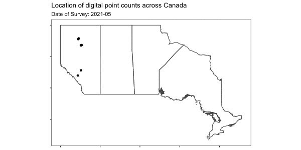

# Operationalizing a national digital point count protocol

This protocol aims to design and establish a standard protocol to conduct a “digital avian point count” using autonomous recording units and handheld recording devices. 

