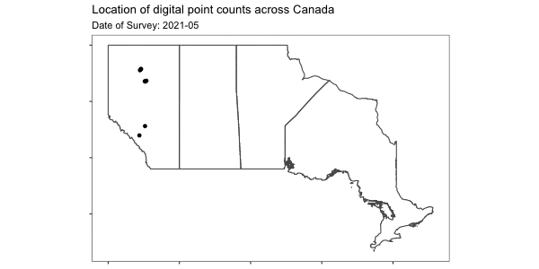
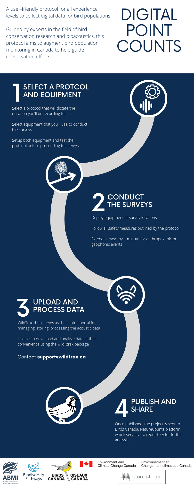

```{r include=FALSE, eval=T}
# automatically create a bib database for R packages
knitr::write_bib(c(
  .packages(), 'bookdown', 'knitr', 'rmarkdown'
), 'packages.bib')
knitr::is_html_output()

library(tidyverse)
library(knitr)
library(kableExtra)
library(downloadthis)
library(bslib)
#library(rmapshaper)
#library(lubridate)
library(fs)
library(sf)
#library(gganimate)
#library(ggforce)
#library(cowplot)
#library(magick)

```

# Home {.unnumbered}

::: rmdnote
[<a href="https://abbiodiversity.github.io/ndpc-fr">Cliquez ici pour accéder à la version française</a>]{style="font-size: 80%; font-weight: bold; color: grey;"}
:::

Welcome to the protocol for conducting a **digital point count** using an autonomous recording unit or hand-held recording device.

In collaboration with a multitude of [partners](#acknowledgements), this user-friendly protocol aims to establish a standard method for collecting data on bird populations in a digital format, making it accessible and easy for citizen scientists to collect and contribute to avian research and population monitoring.

```{r, eval=F, include=F, warning=F, message=F}

locs <- dir_ls(".", recurse = T, regexp = "Locations") %>%
   map_dfr(~read_csv(.)) %>%
   select(location, latitude, longitude)

pcs <- dir_ls(".", recurse = T, regexp = "Tasks") %>%
   map_dfr(~read_csv(.)) %>%
   select(location, recordingDate) %>%
   inner_join(., locs, by = c("location" = "location")) %>%
   filter(!is.na(latitude)) %>%
   mutate(month = format(recordingDate, "%Y-%m")) %>%
   sample_frac(0.05) %>%
   mutate(year = year(recordingDate)) %>%
   st_as_sf(coords = c("longitude","latitude")) %>%
   st_make_valid() %>%
   st_set_crs(4269)

can2 <- read_sf("./data/gis/gpr_000b11a_e.shp") %>%
  filter(PRNAME %in% c("Ontario","Alberta","British Columbia","Saskatchewan","Manitoba")) %>%
  mutate(colour_type = case_when(PRNAME %in% c("Ontario","Alberta") ~ "Bold", TRUE ~ "Faint")) %>%
  st_make_valid() %>%
  st_transform(4269) %>%
  st_set_crs(4269)

can_s <- rmapshaper::ms_simplify(can)

my_colours <- c("Faint" = "#D3D3D3",
             "Bold" = "#303234")

mymap <- ggplot(can_s) +
    coord_sf(crs = 4326) +
    geom_sf(mapping = aes(), fill = NA) +
    scale_colour_manual(values = my_colours) +
    geom_sf(pcs, mapping = aes()) +
    theme_bw() +
    theme(legend.position = "none",
          axis.text.x = element_blank(),
          axis.text.y = element_blank(),
          panel.grid.major = element_blank(),
          panel.grid.minor = element_blank()) +
    ggtitle("Location of digital point counts across Canada",
            subtitle = 'Date of Survey: {closest_state}') +
    transition_states(states = month, transition_length = 0, state_length = , wrap = T) +
    shadow_mark(past = TRUE, alpha = 1) +
    ease_aes('cubic-in-out') +
    enter_fade()

anim_save("./images/map.gif", mymap, width=600, height=300, duration=5)
```

<br> 

The use of autonomous recording units (**ARUs**) and hand-held recording devices in avian point counts, in partnership with leading avian research organizations, provides a standardized protocol for data collection that ensures consistency and comparability of results following established guidelines. The data is collected in a digital format, which makes it easily accessible and shareable among researchers from various organizations, but also archiveable and produces data that can be verified. Citizen scientists can participate in avian research, regardless of prior experience or expertise, and contribute to scientific knowledge. The program is designed to be user-friendly, for all skill levels, with support and guidance from experts.

------------------------------------------------------------------------

::: rmdnote
<p style="font-size:200%; font-weight:bold;">

News

</p>

**This site is currently under construction in preparation for the 2023 field season**

-   **04-30-23**: Initial publication
:::

------------------------------------------------------------------------

## The Basics {.unnumbered}



<hr style="height:2px; visibility:hidden;" />

**1) Select a protocol and equipment**

-   [Select a recorder model](#selecting-a-recorder) and prepare equipment
-   [Select a recording method](#conducting-the-survey), either **segmented** or **continuous**, and a [point count protocol](#download-cheat-sheets)

<br>

**2) Conduct the surveys**

-   [Conduct the point count surveys](#conducting-the-survey)

<br>

**3) Upload and process the data**

-   [Upload the recordings](#data-submission) for [standardization](#speech-to-text)'\*'
-   Process data in [WildTrax](https://www.wildtrax.ca)

<br>

**4) Publish and share**

-   [Publish the data](#canavian)'\*'

'\*' *Currently supported with assistance from the ABMI*

------------------------------------------------------------------------

## Download cheat sheets {#download-cheat-sheets .unnumbered}

Download a digital point count cheat sheet:

**3rd Ontario Breeding Bird Atlas**

-   [Ontario Breeding Bird Atlas 5-minute Roadside Survey]()
-   [Ontario Breeding Bird Atlas 5-minute Off-Road Survey]()

<br>

**Bioacoustic Unit Linear Feature Surveys**

-   [Bioacoustic Unit 3-minute Linear Feature Survey]()

<br>

**Breeding Bird Survey**

-   [Breeding Bird Survey 3-minute Segmented Recording Method]()
-   [Breeding Bird Survey Continuous Recording Method]()

<br>

**Marshbird Monitoring Protocol**

-   [Marshbird Monitoring Protocol 10-minute Survey]()

<br>

[More protocols will be supported soon!]{style="color:grey;font-style:italic"}

------------------------------------------------------------------------

## Frequently Asked Questions {.unnumbered}

-   [Why should I record a point count?](#introduction)
-   [What recorder can I use?](#selecting-a-recorder)
-   [What should I say in the voice note?](#voice-notes)
-   [How much data will I accumulate?](#data-accumulation)
-   [Where do I submit my recordings?](#data-submission)
-   [Should I check my recordings for anything before submitting?](#metadata-confirmation)
-   [How are we working to improve this protocol?](#discussion)

------------------------------------------------------------------------

## Acknowledgements {#acknowledgements .unnumbered}

-   Thank you to [Environment and Climate Change Canada](https://www.canada.ca/en/environment-climate-change.html) for the continued funding and support to realize this project.
-   Thank you to the [Bioacoustic Unit](http://bioacoustic.abmi.ca/), the [Alberta Biodiversity Monitoring Institute](https://abmi.ca/home.html), and Environment and Climate Change Canada for providing the basis of the equipment standards

Thank you for the participation from the following organizations:

-   The 3rd [Ontario Breeding Bird Atlas](https://www.birdsontario.org/)
-   The Bioacoustic Unit

------------------------------------------------------------------------

## Book Legend {.unnumbered}

::: rmdnote
This is a note
:::

::: rmdwarning
This is a warning
:::
